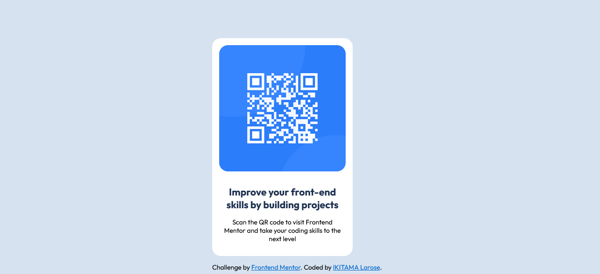

# Frontend Mentor - QR code component solution

This is a solution to the [QR code component challenge on Frontend Mentor](https://www.frontendmentor.io/challenges/qr-code-component-iux_sIO_H). Frontend Mentor challenges help you improve your coding skills by building realistic projects. 

## Table of contents

- [Overview](#overview)
  - [Screenshot](#screenshot)
  - [Links](#links)
- [My process](#my-process)
  - [Built with](#built-with)
  - [What I learned](#what-i-learned)
  - [Useful resources](#useful-resources)
- [Author](#author)


## Overview

### Screenshot




### Links

- Solution URL: [See the repository](https://github.com/ikitamalarose/qr-code-component-challenge.git)
- Live Site URL: [Go to the site](https://qr-code-component-challenge-neon.vercel.app/)

## My process

### Built with

- Semantic HTML5 markup
- CSS custom properties
- Flexbox


### What I learned

```css
@media (max-width:768px) {
  /* codes for mobile design */
}
```


### Useful resources

- [nekocalc](https://nekocalc.com/fr/px-a-rem-convertisseur) - This helped me convert pixels to REM.


## Author

- Frontend Mentor - [@ikitamalarose](https://www.frontendmentor.io/profile/ikitamalarose)
- Twitter - [@ikitamalarose](https://www.twitter.com/ikitamalarose)


